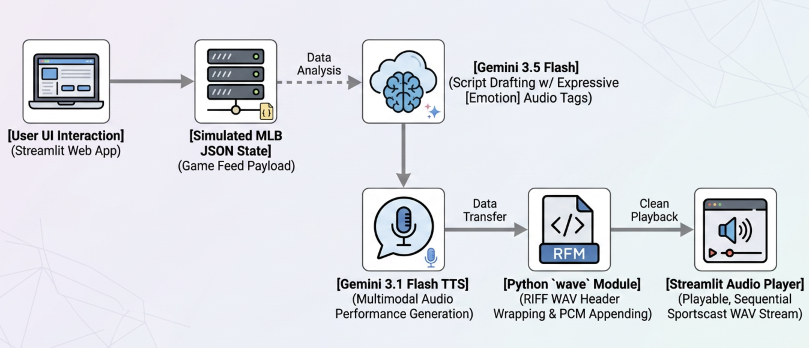

# mlb-voice-demo

# ---

**⚾ MLB Live-to-Voice AI Broadcast Engine**

Welcome to the **MLB Live-to-Voice AI Broadcast Engine** repository\! This demo showcases the dynamic, multimodal capabilities of Google Cloud’s **Gemini Enterprise Agent Platform (Vertex AI)** combined with native **Gemini-TTS Audio Generation**.  
Instead of a standard, static text-to-speech engine, this demo uses **Gemini 3.5 Flash** to analyze a simulated live baseball play-by-play feed (JSON), draft a strategic dual-host broadcast script, and feed those turns to **Gemini 3.1 Flash TTS**—rendering human-like, sports-radio performance audio (with real shouting, pauses, and strategy breakdowns) in real-time.

## ---

**🏗️ Architecture & Data Flow**



## ---

**🛠️ Prerequisites & Local Setup**

To deploy this in your own Google Cloud project, you need:

* A Google Cloud Project with billing enabled.  
* The Google Cloud SDK (gcloud CLI) installed locally, or access to Google Cloud Shell.  
* Owner or Editor role on the target GCP project.

### **1\. Clone this Repository**

Clone this repository to your local machine or your Cloud Shell instance:  
```
git clone https://github.com/sir-rob/mlb-voice-demo.git  
cd mlb-voice-demo
```
## ---

**🚀 Deployment Guide (Step-by-Step)**

### **Step 1: Initialize Your Project Variables**

In your terminal, set your Active GCP Project ID:
```  
export PROJECT_ID="YOUR_PROJECT_ID_HERE"  
gcloud config set project $PROJECT_ID
```
### **Step 2: Enable the Required APIs**

Enable the primary service APIs required for compiling the container, hosting the serverless frontend, and running the generative model suite:  
```
gcloud services enable \
    aiplatform.googleapis.com \
    run.googleapis.com \
    artifactregistry.googleapis.com \
    cloudbuild.googleapis.com
```
### **Step 3: Grant IAM Permissions to the Service Account**

Cloud Run containers run securely under a specific service account identity. By default, it uses the **Compute Engine default service account** unless custom identities are declared.  
To grant your Cloud Run container permission to call Vertex AI models (Gemini 3.5 Flash & Gemini 3.1 Flash TTS), you must bind the **Vertex AI User** (roles/aiplatform.user) role:  
\# 1\. Fetch your Google Cloud Project Number  
```
export PROJECT_NUMBER=$(gcloud projects describe $PROJECT_ID --format="value(projectNumber)")
```

\# 2\. Define the default Compute Engine service account running the container  
```
export CLOUD_RUN_SA="${PROJECT_NUMBER}-compute@developer.gserviceaccount.com"
```

\# 3\. Bind the Vertex AI User role to your service account  
```
gcloud projects add-iam-policy-binding $PROJECT_ID \
    --member="serviceAccount:${CLOUD_RUN_SA}" \
    --role="roles/aiplatform.user"
```
### **Step 4: Deploy the Application to Cloud Run**

Execute this command from inside the directory. Cloud Build will automatically compress your files, upload them to Artifact Registry, compile the secure Docker container, and deploy it to a serverless Cloud Run instance:  
```
gcloud run deploy mlb-voice-demo \
    --source . \
    --region us-central1 \
    --allow-unauthenticated \
    --set-env-vars GOOGLE_CLOUD_PROJECT=$PROJECT_ID
```
*Note: When asked to authorize the creation of an Artifact Registry repository, type y to accept.*  
Once completed, the terminal will print your secure URL:  
Service \[mlb-voice-demo\] has been deployed and is serving 100% of traffic.  
Service URL: https://mlb-voice-demo-xxxxxx.a.run.app

## ---

**🔒 Security & Enterprise Gaps (Caveats)**

This demo is designed for **customer engineering and sales prototyping**. Before migrating this deployment framework into a production enterprise environment, please address the following security considerations:

| Risk Area | Demo Implementation | Production Best Practice |
| :---- | :---- | :---- |
| **Authentication** | \--allow-unauthenticated parameter is used during deploy to allow public access to the URL. | Secure the endpoint using Google Cloud Identity-Aware Proxy (IAP) or Firebase Authentication to restrict access to company domains. |
| **Service Accounts** | The app runs under the powerful default Compute Engine Service Account. | Create a dedicated, fine-grained service account with *least-privilege* access containing only roles/aiplatform.user and assign it explicitly using \--service-account. |
| **Simulated Data** | Game stats are hardcoded into an editable text box. | Securely connect to live, authenticated sports stats APIs (such as the MLB Gameday API) over HTTPS using Secret Manager to store API credentials. |

## ---

**🎙️ How to Deliver a Show-Stopping Customer Demo**

To get the absolute best crowd reaction when presenting this to clients or internal stakeholders, follow this script:

### **Play 1: The "Walk-Off" (The Hype Generator)**

1. Open your deployed Streamlit URL.  
2. Leave the default walk-off Home Run JSON values exactly as they are.  
3. Click **Generate Live Broadcast Audio 🎙️**.  
4. Show the client the **Generated Broadcast Script** first, pointing out how the announcer turn was dynamically prefixed with \[screaming\] and the commentator's turn was prefixed with \[thoughtful\].  
5. Play the audio. The room will hear the announcer (using the voice profile *Puck*) transition from standard reading into a loud, high-energy shout when Giancarlo Stanton hits the walk-off home run.

### **Play 2: The "Fast Pivot" (Dynamic Adaptability)**

1. Tell the audience: *"What happens if the game state completely shifts? In legacy application structures, you would have to spend days re-recording voices. Here, it is instant."*  
2. In the JSON box on the left, change the outcome from "Home Run" to "Strikeout Looking".  
3. Change the description to: *"Stanton watches a 98mph cutter clip the outside corner for strike three. Game over, Red Sox win."*  
4. Click **Generate Live Broadcast Audio 🎙️** again.  
5. Play the new clip. The announcer's voice will pivot instantly into a disappointed, somber cadence, while the color analyst automatically takes over with a strategic review of how the pitcher struck out the batter—proving true, state-of-the-art generative media responsiveness with zero code changes\!